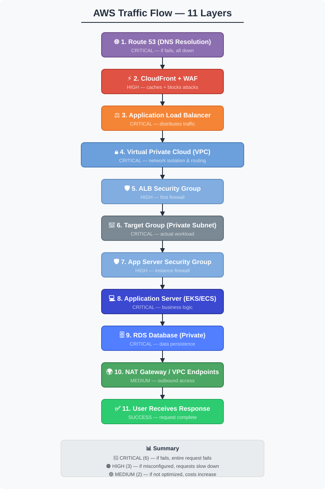

# Module 0 Review — Format & Structure Compliance

## ✅ What Works Well

### Content Quality
- ✅ Comprehensive traffic flow coverage (11 layers)
- ✅ Real-world troubleshooting scenarios with bash commands
- ✅ ASCII diagrams clearly show request path
- ✅ Excellent debugging flowcharts
- ✅ Practical lessons learned with root cause analysis

### Alignment with Module 01
- ✅ Core Components table present (similar format)
- ✅ Build Steps section (scenario-based walkthrough)
- ✅ Lessons Learned section (expanded, good detail)
- ✅ Validation Checklist present
- ✅ Last Updated date included
- ✅ Clear problem→debugging→solution flow

---

## ⚠️ Format Issues — Needs Adjustment

### Issue 1: Missing Architecture Diagram Reference
**Module 01 does**:
```markdown
# 01 — VPC Networking Basics


```

**Module 0 does**:
- Uses large ASCII diagram embedded in markdown

**Recommendation**:
```markdown
# 0 — Complete AWS Traffic Flow


[Large ASCII diagram below can go in DIAGRAMS.md or be simplified]
```

**Action**: Create an `architecture-diagram.svg` file showing the 11-layer traffic flow (or simplify the ASCII art).

---

### Issue 2: Emoji Usage (Style Inconsistency)
**Module 01 format**:
```markdown
## Overview
## Why This Matters
## Core Components
## Build Steps
```

**Module 0 format**:
```markdown
## 🎯 Overview
## 🔄 The Complete Traffic Flow
## 🔧 Core Components
## 🛠️ Build Steps
## ⚠️ Lessons Learned
```

**Issue**: Module 01 doesn't use emojis. For consistency:

**Recommendation**: 
- **Option A (Recommended)**: Remove emojis, match Module 01 style
- **Option B**: Add emojis to Module 01 for consistency across portfolio

**Suggested approach**: Strip emojis for this repo's existing style.

---

### Issue 3: Section Organization
**Module 01 order**:
1. Title
2. Diagram reference
3. Overview
4. Why This Matters
5. Core Components table
6. Build Steps
7. Lessons Learned
8. Validation Checklist

**Module 0 order**:
1. Title
2. Overview (with sub-sections)
3. The Complete Traffic Flow (large section)
4. Core Components table
5. Build Steps (detailed scenarios)
6. Lessons Learned (5 real scenarios)
7. ✅ Validation Checklist
8. 🔍 Troubleshooting Flowchart (NEW)
9. 📊 Request Flow Timings (NEW)
10. 🎯 Layer-by-Layer Debugging (NEW)
11. 📚 Next Steps & Integration (NEW)
12. 🔗 Related Resources (NEW)

**Issue**: Extra sections don't exist in Module 01. For consistency:

**Recommendation**:
- Keep "Troubleshooting Flowchart" (part of Lessons Learned)
- Move "Request Flow Timings" → Build Steps section (as reference)
- Fold "Layer-by-Layer Debugging" → into Validation Checklist
- Keep "Next Steps & Integration" and "Related Resources" (both good additions)

---

### Issue 4: Build Steps Format
**Module 01**:
- Numbered 1-10
- High-level steps (Plan → Create → Test)
- Brief descriptions, simple format

**Module 0**:
- Detailed scenario walkthrough with 11 steps
- Heavy bash/command-line examples
- Multiple sub-steps per layer
- Very verbose but educational

**Issue**: Module 0 is far more detailed (good for learning, but breaks formatting pattern).

**Recommendation**: Keep the detailed content but restructure:
- Main steps 1-11 (high-level, like Module 01)
- Move detailed bash commands to **Lessons Learned** (already done)
- OR create a separate `TROUBLESHOOTING.md` with full debugging commands

---

### Issue 5: ASCII Diagram Size
**Module 0's ASCII diagram**:
- ~150 lines (very large)
- Hard to read on mobile
- Should be `.svg` file instead

**Recommendation**:
```
Option A: Create architecture-diagram.svg
├─ Visual showing 11 layers
├─ Color-coded by layer (DNS, CDN, ALB, VPC, etc.)
└─ Reference with: 

Option B: Keep ASCII but move to separate file
├─ Create DIAGRAMS.md
├─ Reference in main README with link
└─ Keep main README more concise
```

---

## 🔧 Reformatting Recommendations

### Header Hierarchy (Consistency with Module 01)

**Current**:
```markdown
# Module 0: Complete AWS Traffic Flow

## 🎯 Overview
### Why This Matters
```

**Recommended**:
```markdown
# 0 — Complete AWS Traffic Flow


## Overview
This module maps the complete journey of a production request...

### Why This Matters
When something breaks...
```

---

### Remove Emojis

**Current**:
```markdown
## 🔄 The Complete Traffic Flow
## 🔧 Core Components (Quick Reference)
## 🛠️ Build Steps — Tracing a Real Request
## ⚠️ Lessons Learned
## ✅ Validation Checklist
## 🔍 Complete Troubleshooting Flowchart
```

**Recommended**:
```markdown
## The Complete Traffic Flow
## Core Components
## Build Steps
## Lessons Learned
## Troubleshooting Guide
## Validation Checklist
```

---

### Simplify Build Steps (Keep Detail in Lessons)

**Current**: 11 subsections with full bash examples in Build Steps

**Recommended**:

```markdown
## Build Steps — Tracing a Real Request

Follow this flow for a production request to `https://app.example.com/api/data`:

1. **DNS Resolution** — Route 53 resolves domain to IP
2. **CloudFront Edge** — Request hits CDN, cache checked, WAF applied
3. **ALB TLS Termination** — ALB accepts HTTPS, terminates TLS
4. **VPC Routing** — Route table determines local vs. internet
5. **ALB Security Group** — Stateful firewall allows port 443 inbound
6. **Target Selection** — ALB picks healthy target from pool
7. **App Security Group** — Allows port 8080 from ALB only
8. **Application Processing** — App handles request, queries database
9. **Database Access** — RDS responds to app query
10. **Egress/NAT** — App calls external APIs through NAT Gateway
11. **Response Path** — Response returns through layers, cached in CloudFront

### Detailed Scenario: User Visits `https://app.example.com/api/data`

See **Lessons Learned** section for complete debugging examples, bash commands, 
and real root causes for each layer.
```

---

### Reorganize Sections for Consistency

**Restructured order** (matching Module 01 flow):

```markdown
# 0 — Complete AWS Traffic Flow


## Overview
...

### Why This Matters
...

## Core Components
[Keep the table]

## The Complete Traffic Flow
[ASCII diagram OR reference to architecture-diagram.svg]

## Build Steps
[11 steps, high-level, concise]

## Lessons Learned
[5 real scenarios with detailed bash commands]
├─ Scenario 1: Connection Timeout
├─ Scenario 2: Database Connection Timeout
├─ Scenario 3: High Latency
├─ Scenario 4: No Internet Access
└─ Scenario 5: WAF Blocking

## Troubleshooting Flowchart
[Decision trees for common issues]

## Validation Checklist
[Layer-by-layer checks with test commands]

## Next Steps & Integration
[How this module fits into the portfolio]

## Related Resources
[AWS docs, tools, etc.]
```

---

## 📋 Specific File Changes Needed

### 1. Rename/Format Header
```diff
- # Module 0: Complete AWS Traffic Flow — Request Journey Through All Layers
+ # 0 — Complete AWS Traffic Flow
```

### 2. Add Architecture Diagram Reference
```diff
+ 
+ 
  ## Overview
```

### 3. Strip Emojis from Section Headers
```diff
- ## 🎯 Overview
+ ## Overview

- ## 🔄 The Complete Traffic Flow
+ ## The Complete Traffic Flow

- ## 🔧 Core Components (Quick Reference)
+ ## Core Components
```

### 4. Simplify Build Steps (Keep 11 steps high-level)
- Keep structure but remove embedded bash examples
- Move detailed examples to Lessons Learned

### 5. Create Separate Files (Optional)
```
module-00/
├── README.md (main module)
├── architecture-diagram.svg (new)
├── DIAGRAMS.md (optional: detailed ASCII)
└── TROUBLESHOOTING.md (optional: reference guide)
```

---

## ✅ Files to Create/Update

### Must Create
1. **architecture-diagram.svg** — Visual representation of 11-layer flow
   - Can be simpler than the ASCII version
   - Should show: DNS → CloudFront → ALB → VPC → App → DB

### Should Update
1. **README.md** — Apply formatting changes above
2. Check filenames match convention: `module-00/` or `00-aws-traffic-flow/`?

### Optional (Adds Depth)
1. **TROUBLESHOOTING.md** — Move detailed scenarios here
2. **QUICK_REFERENCE.md** — Layer-by-layer debugging commands

---

## 🎯 Summary Checklist

- [ ] Rename title to match Module 01 format: `# 0 — Complete AWS Traffic Flow`
- [ ] Add diagram reference: ``
- [ ] Remove all emojis from headers
- [ ] Create or refine `architecture-diagram.svg` file
- [ ] Simplify Build Steps (keep high-level, move details to Lessons)
- [ ] Keep the 5 Lessons Learned scenarios (excellent!)
- [ ] Keep Troubleshooting Flowchart section
- [ ] Keep Validation Checklist with test commands
- [ ] Keep "Next Steps & Integration" section (valuable for portfolio flow)
- [ ] Keep "Related Resources" section
- [ ] Verify Module 00 folder structure matches Module 01
- [ ] Test all bash commands in Lessons Learned section (update if AWS API changes)

---

## Overall Assessment

**Grade: A- (Excellent content, minor formatting needed)**

**Strengths**:
- ✅ Comprehensive 11-layer coverage
- ✅ Real troubleshooting scenarios
- ✅ Excellent debugging guidance
- ✅ Good structure overall

**Needs Adjustment**:
- ⚠️ Format consistency with Module 01 (remove emojis, add SVG diagram)
- ⚠️ Build Steps could be more concise (detail belongs in Lessons)
- ⚠️ Some sections could be optional/reference files

**After adjustments**: This will be **perfect foundational module** for the portfolio.

