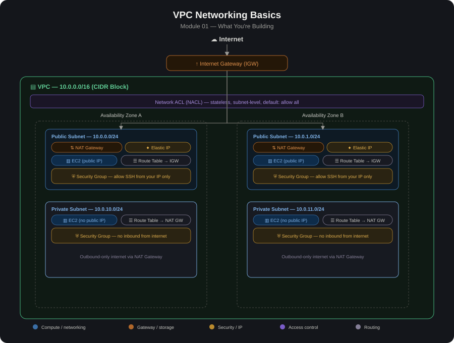

# 01  VPC Networking Basics

# Overview

This module covers the foundational building blocks of Amazon VPC (Virtual Private Cloud) — the networking layer everything else in this portfolio (Transit Gateway, VPN, Direct Connect, multi-tier apps, NAT) sits on top of. The goal is a working VPC with public and private subnets,correct routing, and instances that can reach the internet appropriately based on their tier.

# Why This Matters

A VPC is your own logically isolated slice of the AWS network. Every other module in this portfolio assumes a solid grasp of these fundamentals:
CIDR planning, subnet types, route tables, and gateways are the vocabulary everything else builds on.

## Architecture Diagram

# Core Concepts

1. CIDR Block - The IP address range for your VPC (e.g., 10.0.0.0/16) and each subnet within it (e.g., 10.0.1.0/24). Determines how many IPs are available and how subnets can be carved up.
2. Subnet - A range of IP addresses within the VPC, tied to a single Availability Zone. Subnets are "public" or "private" based on their route table, not any inherent property.
3. Availability Zone (AZ) - An isolated physical data center location within a region. Spreading subnets across 2+ AZs is the basis for high availability.
4. Internet Gateway (IGW) - A VPC-attached, horizontally scaled gateway that allows communication between the VPC and the internet. One per VPC.
5. Route Table - A set of rules ("routes") that determine where network traffic is directed. Each subnet is associated with exactly one route table.
6. NAT Gateway - Lets instances in private subnets initiate outbound internet connections without being directly reachable from the internet (see the dedicated NAT modules for HA/regional patterns).
7. Security Group - A stateful, instance-level virtual firewall — controls inbound/outbound traffic per ENI/instance. Return traffic is automatically allowed.
8. Network ACL (NACL) - A stateless, subnet-level firewall — evaluated in rule-number order, and you must explicitly allow both inbound and outbound (including ephemeral return ports).
9. Elastic IP (EIP) - A static, public IPv4 address you can allocate and attach to resources (e.g., NAT Gateways, EC2 instances) so the public IP doesn't change on stop/start.

# What Makes a Subnet "Public" vs. "Private"

A subnet is only "public" if its route table has a route sending 0.0.0.0/0 traffic to an Internet Gateway. There's no separate "public subnet" checkbox — it's purely about routing:

Public subnet: route table has 0.0.0.0/0 → IGW. Instances here need a public IP or Elastic IP to actually be reachable, but the subnet itself is what allows the path to exist.
Private subnet: route table has 0.0.0.0/0 → NAT Gateway (for outbound-only internet), or no default route at all (fully isolated, e.g., a database subnet).

# Build Steps (typical order)

1. Plan your CIDR ranges
   Pick a VPC CIDR (e.g., 10.0.0.0/16) with enough room to subdivide.
   Plan subnets per AZ per tier (e.g., 10.0.0.0/24 public-AZ-A,10.0.1.0/24 public-AZ-B, 10.0.10.0/24 private-AZ-A, etc.) —leave room to grow; don't carve CIDRs    too tightly.
2. Create the VPC with the chosen CIDR block.
3. Create subnets — at least one public and one private subnet in each of 2+ AZs, for redundancy.
4. Create and attach an Internet Gateway to the VPC.
5. Create a NAT Gateway in a public subnet (with an Elastic IP) if private subnets need outbound internet access.
6. Create route tables
   Public route table: 0.0.0.0/0 → IGW. Associate with public subnets.
   Private route table: 0.0.0.0/0 → NAT Gateway. Associate with private subnets.
7. Create security groups for your intended resources (e.g., allow SSH from your IP only, HTTP/HTTPS as needed) — start restrictive, open only what's required.
8. (Optional) Adjust NACLs if you need subnet-level rules beyond security groups — most setups can rely on the default "allow all" NACL and do all filtering at the security group level.
9. Launch a test instance in the public subnet (with a public IP) and one in the private subnet (no public IP) to validate reachability.
10 . Test connectivity
     Public instance: reachable from the internet (e.g., SSH from your machine), and can reach the internet.
     Private instance: not reachable from the internet, but can reach the internet outbound via the NAT Gateway (e.g., curl https://checkip.amazonaws.com should return the NAT Gateway's EIP).

# Lessons Learned

1. A subnet's "public/private" label is just routing — attaching an IGW to the VPC doesn't make every subnet public; only subnets whose route table points 0.0.0.0/0 at the IGW are public.
2. Public IP vs. reachability — an instance can have a public IP but still be unreachable if its subnet's route table doesn't route to an IGW, or if security groups/NACLs block the traffic.
3. NACLs are stateless — forgetting to allow the ephemeral port range (1024–65535) on the outbound (or inbound, depending on direction) side is a classic cause of "one-way" connectivity that's confusing to debug. Most people leave NACLs at their default "allow all" and rely on security groups instead, unless there's a specific need for subnet-wide blocking.
4. CIDR planning is hard to change later — VPC and subnet CIDR blocks are difficult/impossible to resize without recreating resources; plan
with room for growth (extra AZs, extra tiers) from the start.
5. One subnet = one AZ — you cannot span a single subnet across multiple AZs; high availability requires multiple subnets, one per AZ.
6. Default VPC vs. custom VPC — AWS accounts come with a default VPC (all-public, simple) which is fine for quick tests but shouldn't be used for anything resembling production; this module intentionally builds a custom VPC to control the design explicitly.
7. Route table default association — every subnet is associated with the VPC's main route table unless explicitly changed; verify each subnet is on the intended route table, not accidentally left on the default.

# Validation / Testing Checklist

- [ ] VPC created with the planned CIDR block.
- [ ] Public and private subnets exist in 2+ AZs.
- [ ] Internet Gateway attached to the VPC.
- [ ] Public route table has 0.0.0.0/0 → IGW, associated with public subnets.
- [ ] NAT Gateway created (with EIP) in a public subnet.
- [ ] Private route table has 0.0.0.0/0 → NAT Gateway, associated with private subnets
- [ ] Public instance is reachable from the internet (e.g., SSH)
- [ ] Private instance is not reachable from the internet directly
- [ ] Private instance can reach the internet outbound (via NAT)
- [ ] Security groups restrict access to only what's needed (no unnecessary 0.0.0.0/0 inbound rules beyond intended ports)
