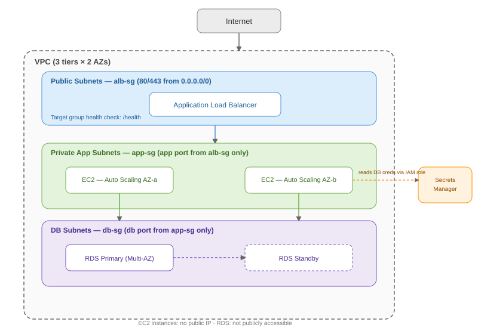

# 03  Multi-Tier App (ALB + ASG + RDS)

# Overview

This module builds a classic three-tier web application architecture on AWS: a public-facing Application Load Balancer (ALB), an Auto Scaling Group (ASG) of EC2 instances running the app in private subnets, and a Multi-AZ RDS database in isolated database subnets.
Each tier sits in its own layer of the VPC, with security groups enforcing that traffic only flows one tier to the next �?" never skipping a layer or reaching the database directly from the internet.

# Why This Pattern
1.  Scalability �?" the ASG adds/removes EC2 instances automatically based on load, instead of running a fixed, potentially oversized (or undersized) fleet.
2.  High availability �?" resources are spread across multiple Availability Zones (AZs), so a single AZ failure doesn't take the app down.
3.  Security by layering �?" only the ALB is internet-facing; app servers and database are never directly reachable from the public internet.
4.  Decoupled tiers �?" web/app tier and database tier can be scaled,patched, and secured independently.

## Architecture Diagram

# Core Components

1. VPC with 3 subnet tiers: Public subnets (ALB, NAT Gateway), private app subnets (EC2/ASG), private DB subnets (RDS) �?" each tier duplicated across �?�2 AZs.
2. Internet Gateway (IGW): Gives the public subnets (and thus the ALB) internet reachability.
3. NAT Gatewa: yLets instances in private subnets reach the internet outbound (e.g., OS updates) without being reachable inbound.
4. Application Load Balancer (ALB): Public entry point; terminates HTTP/HTTPS, distributes traffic across healthy instances in the ASG, performs health checks.
5. Target Group: The set of instances the ALB routes to; defines the health check path/port.
6. Auto Scaling Group (ASG): Manages the fleet of EC2 app instances �?" launches/terminates based on a scaling policy, spread across AZs.
7. Launch Template: Defines what each ASG instance looks like �?" AMI, instance type, user data (bootstrap script), IAM instance profile, security group.
8. RDS (Multi-AZ): The database tier �?" a primary instance with a synchronously replicated standby in a second AZ for automatic failover.
9. DB Subnet Group: Tells RDS which (private, isolated) subnets it's allowed to launch into.
10. Security Groups (chained): ALB SG allows inbound 80/443 from 0.0.0.0/0. App SG allows inbound only from the ALB SG. DB SG allows inbound (e.g., 3306/5432) only from the App SG.

# Build Steps (typical order):

1. Design and build the VPC CIDR block, 3 subnet tiers �- 2+ AZs (public, app/private, DB/private).
Internet Gateway attached; NAT Gateway(s) in the public subnet(s) �?"one per AZ for HA, or one shared to save cost in non-prod.

2. Create security groups first (referenced by later resources)
alb-sg: inbound 80/443 from anywhere, outbound to app tier.
app-sg: inbound app port only from alb-sg, outbound to db tier + internet (via NAT) for updates.
db-sg: inbound db port only from app-sg.

3. Create the RDS instance
Multi-AZ enabled, placed via a DB subnet group covering the private DB subnets.
Store credentials in Secrets Manager (avoid hardcoding in user data or app config).

4. Create a Launch Template
AMI (custom or base + user data bootstrap), instance type, key pair,app-sg, IAM instance profile (least-privilege �?" e.g., permission to read the DB secret from Secrets Manager, nothing else).
User data: install/start the app, pull DB connection info from Secrets Manager at boot (don't bake secrets into the AMI).

5. Create the Target Group + ALB
Target group with a health check path (e.g., /health).
ALB in the public subnets, listener on 80 (redirect to 443) and 443 (with an ACM certificate) forwarding to the target group.

6. Create the Auto Scaling Group
Attach the launch template, target the private app subnets (across AZs), attach it to the ALB's target group.
Define min/max/desired capacity and a scaling policy (e.g.,target tracking on CPU utilization or ALB request count per target).

7. Test end-to-end
Hit the ALB DNS name / custom domain �?" confirm the app responds and can read/write to RDS.
Confirm app instances are not individually reachable from the internet (no public IP, and app SG blocks direct access anyway).
Confirm RDS is not publicly accessible.

# Failure testing:
1. Terminate an app instance manually �?" confirm ASG replaces it and ALB stops routing to it during the outage (health checks failing).
2. Trigger a scaling event (e.g., stress CPU) and confirm the ASG scales out, then back in when load drops.

# Lessons Learned
1. Security group chaining, not CIDR-based rules �?" referencing alb-sg / app-sg as the source in the next tier's inbound rule (not a CIDR range) means it stays correct even as instances scale up/down or get new IPs.
2. RDS must NOT be in public subnets, and "Publicly accessible" should be set to No �?" this is a common oversight that exposes the database directly to the internet.
3. Don't bake DB credentials into the AMI or user data in plaintext �?"pull them from Secrets Manager (or Parameter Store) at boot using the instance's IAM role.
4. Health check path matters �?" if the ALB health check hits a path that requires DB connectivity and RDS isn't ready yet at boot, instances can get marked unhealthy and cycle repeatedly; consider a lightweight /health endpoint that doesn't depend on the DB, or add sufficient ASG/ALB health check grace period.
5. NAT Gateway cost �?" a NAT Gateway per AZ is best practice for HA but adds cost; a single shared NAT Gateway is common for lab/dev environments as a cost trade-off (call this out explicitly if you did it).
6. Multi-AZ RDS failover isn't instant �?" expect ~60�?"120 seconds of downtime during failover; the app should have basic retry logic for DB connections rather than assuming an always-instant connection. 
7. ASG scale-in can kill connections mid-request �?" enable connection draining / deregistration delay on the target group so in-flight requests finish before an instance is removed.
8. Least-privilege IAM �?" the EC2 instance profile should only have the specific permissions it needs (e.g., secretsmanager:GetSecretValue on the one secret), not broad * access.

# Validation / Testing Checklist:
- [ ] ALB DNS name / custom domain serves the app over HTTPS
- [ ] App instances have no public IP and are unreachable directly from the internet
- [ ] RDS "Publicly accessible" = No; unreachable outside the app SG
- [ ] Target group shows all instances Healthy
- [ ] Terminating an instance �?' ASG replaces it automatically
- [ ] Scaling policy triggers scale-out under load and scale-in after
- [ ] RDS Multi-AZ failover test causes only a brief app interruption, then recovers
- [ ] Secrets are pulled from Secrets Manager/Parameter Store, not hardcoded anywhere
