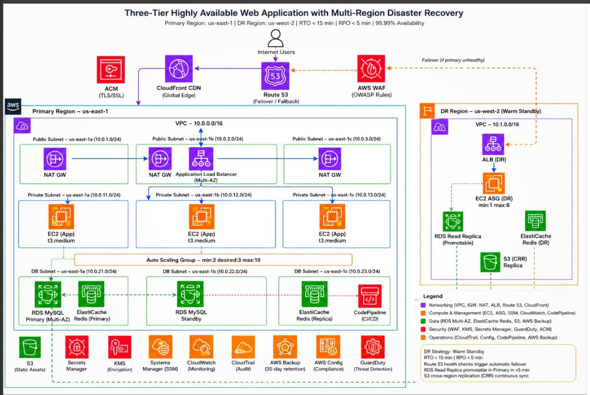

# Three-Tier Highly Available Web Application with Multi-Region Disaster Recovery

## Overview
A production-grade AWS reference architecture for a three-tier web application with automated multi-region failover. Designed for **99.99% availability** with an **RTO < 15 minutes** and **RPO < 5 minutes**.

- **Primary Region:** us-east-1
- **DR Region:** us-west-2 (warm standby)

## Architecture Highlights

### Edge & Security
- **Route 53** — DNS failover routing with health checks to trigger automatic regional failover
- **AWS WAF** — OWASP-based rule set protecting against common web exploits
- **CloudFront** — Global CDN edge distribution
- **ACM** — TLS/SSL certificate management

### Primary Region (us-east-1) — VPC 10.0.0.0/16
- **Public tier:** 3× NAT Gateways + Application Load Balancer across 3 AZs
- **App tier:** EC2 (t3.medium) in an Auto Scaling Group (min:2, desired:3, max:10) across 3 private subnets
- **Data tier:** RDS MySQL (Multi-AZ primary + standby), ElastiCache Redis (primary + replica), CodePipeline for CI/CD

### DR Region (us-west-2) — VPC 10.1.0.0/16, Warm Standby
- ALB + EC2 Auto Scaling Group (min:1, max:6) kept warm for fast scale-out
- RDS Read Replica (promotable) kept in sync with primary
- ElastiCache Redis (DR) and S3 Cross-Region Replication (CRR)

### Cross-Cutting Services
- **Security:** Secrets Manager, KMS, GuardDuty, ACM
- **Operations:** CloudTrail, AWS Config, AWS Backup (35-day retention), Systems Manager (SSM), CloudWatch

## Disaster Recovery Strategy
| Metric | Target |
|---|---|
| RTO | < 15 minutes |
| RPO | < 5 minutes |
| Failover trigger | Route 53 health checks |
| RDS failover | Read replica promotion in Primary in <5 min |
| Data sync | S3 Cross-Region Replication (continuous) |

## Design Rationale
This pattern is intended for workloads that need aggressive availability targets without the operational cost of full active-active multi-region deployment. The DR region runs a minimally-sized "warm" fleet (ASG min:1) that scales out on failover rather than sitting fully idle (cold standby) or fully scaled (hot/active-active), balancing cost against recovery speed.

## Tech Stack
`AWS VPC` `Route 53` `CloudFront` `WAF` `ALB` `EC2 / ASG` `RDS MySQL (Multi-AZ)` `ElastiCache Redis` `S3 CRR` `CodePipeline` `CloudTrail` `Config` `GuardDuty` `KMS` `Secrets Manager`
