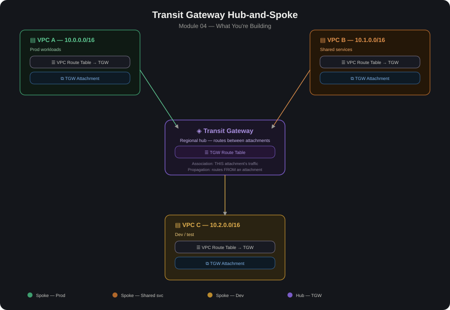

# 04 transit-gateway-hub-spoke

 # Overview

This module implements a hub-and-spoke network topology on AWS using Transit Gateway (TGW) as the central hub. Multiple VPCs ("spokes") attach
to the TGW instead of peering with each other directly, giving a single, scalable point of control for routing, connectivity, and (optionally)
inspection.

# Why Transit Gateway over VPC Peering

VPC Peering is not transitive �?,???? with N VPCs you'd need up to N(N-1)/2 peering connections. TGW turns this into N attachments (one per VPC).
Centralized routing �?,???? one or more TGW route tables control who can talk to whom, instead of managing route tables per peering connection.
Scales to on-prem and multi-region �?,???? TGW also accepts Direct Connect Gateway and Site-to-Site VPN attachments, and can be peered across regions.

## Architecture Diagram

# Core Components

1. Transit Gateway (TGW): The regional hub resource that routes traffic between attachments.
2. TGW Attachment: Connects a VPC (via a subnet in each AZ), VPN, or Direct Connect Gateway to the TGW.
3. TGW Route Table: Controls which attachments can reach which CIDR ranges. You can have multiple route tables to segment traffic (e.g., prod vs. dev).
4. VPC Route Table: Each spoke VPC's subnet route table needs a route pointing non-local CIDRs at the TGW attachment (tgw-xxxxxxxx).
5. Association vs. Propagation: Association = which route table an attachment uses to route ITS traffic. Propagation = which route table LEARNS routes FROM that attachment.

# Build Steps (typical order)
1. Create the VPCs �?,???? hub + spoke(s), each with non-overlapping CIDR blocks (critical �?,???? TGW does not do NAT/overlap resolution).
2. Create the Transit Gateway.
3. Create TGW attachments �?,???? one per VPC, selecting a subnet in each AZ you want reachable.
4. Create TGW route table(s) �?,???? e.g., rt-hub, rt-spoke �?,???? and set:
   Associations: which attachment uses which route table.
   Propagations: which attachments' CIDRs get auto-added as routes.
5. Update VPC subnet route tables �?,???? add a route for the other VPCs'CIDRs (or 0.0.0.0/0 if routing all egress through the hub) with target the TGW.
6. Security Groups / NACLs �?,???? TGW does not filter traffic itself (unless paired with AWS Network Firewall); enforce isolation at the VPC/instance layer too.
7. Test connectivity �?,???? e.g., ping/curl between instances in different spokes, and confirm blocked paths actually fail (spoke-to-spoke if that's supposed to be denied).

# Route Table Segmentation Patterns
1. Single TGW route table (flat/full-mesh): every spoke can reach every other spoke. Simple but least isolation.
2. Hub-and-spoke isolation: spokes associate to a "spoke" route table that only propagates the hub's routes (not other spokes'). Spokes can reach the hub (and, through it, shared services or on-prem) but not each other.
3. Segmented (e.g., prod isolated from dev/test): multiple route tables, selectively propagating only the CIDRs that should be reachable �?,????useful for compliance boundaries.

# Lessons Learned
1. CIDR ranges across all VPCs must not overlap.
2. A VPC route table entry pointing at the TGW only takes effect for subnets actually listed in that route table �?,???? check every subnet that needs it.
3. TGW attachments need a subnet in each AZ you want to route through, for HA; missing an AZ means instances there can't use the attachment.
4. Remember both directions: spoke �?????T hub/other-spoke and the return route back, or you'll get asymmetric routing / blackholed traffic.
5. Data transfer through TGW is billed per GB plus a per-attachment hourly charge �?,???? worth calling out in the cost section of the write-up.
6. If you added a firewall/NVA in the hub VPC for inspection, you need an additional "inspection" TGW route table so traffic is routed through the appliance rather than directly hub-to-spoke.

#  Validation / Testing Checklist
- [ ] Instance in Spoke A can reach instance in Spoke B (if allowed).
- [ ] Instance in Spoke A cannot reach Spoke C (if isolation intended).
- [ ] Spoke instances can reach shared services in the hub VPC.
- [ ] On-prem (VPN/DX) can reach permitted spoke CIDRs.
- [ ] Route tables show expected propagated routes (aws ec2     get-transit-gateway-route-table-propagations).
- [ ] No unintended 0.0.0.0/0 propagation exposing spokes to each other.
