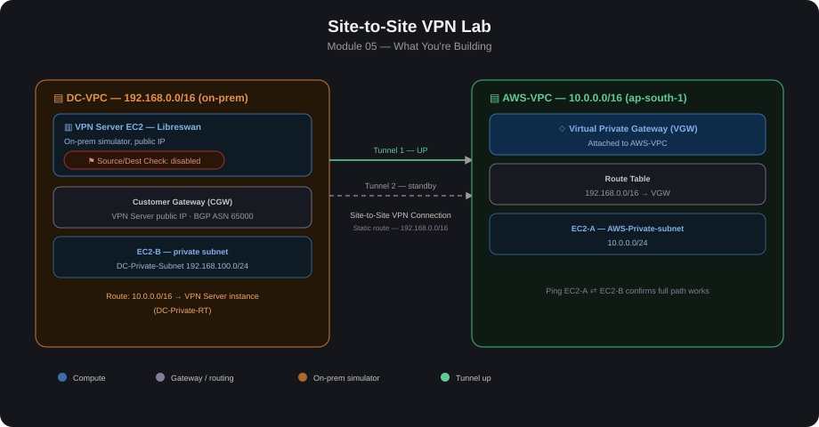

# 05 – Site-to-Site VPN Lab

# Overview

This lab simulates a hybrid connection between an on-premises network and AWS using an IPsec Site-to-Site VPN. Since a physical on-prem
router/firewall isn't available, a second VPC (or a software router like strongSwan/OpenSwan on an EC2 instance) stands in as the "on-prem" side.

If this follows on from the Transit Gateway module, the VPN can attach either directly to a VPC (Virtual Private Gateway) or to the Transit
Gateway as another spoke — extending the hub-and-spoke topology to include on-prem.

## Architecture Diagram

# Core Components

1. Customer Gateway (CGW): Represents the on-prem side — its public IP and BGP ASN (if using dynamic routing).
2. Virtual Private Gateway (VGW) or Transit Gateway (TGW): The AWS side termination point. VGW attaches to a single VPC; TGW lets the VPN act as one more spoke alongside your other VPCs.
3. Site-to-Site VPN Connection: The actual IPsec tunnel(s) between CGW and VGW/TGW — AWS creates two tunnels for redundancy.
4. Routing (static or BGP/dynamic): Determines how routes are exchanged — static CIDR entries, or BGP if the on-prem device supports it.
5. On-prem simulator: EC2 instance running strongSwan/Libreswan, or a second VPC with a software VPN appliance, standing in for a real on-prem router.

# Two Ways to Terminate the VPN

1. VPN → Virtual Private Gateway (VGW) → single VPC Simple, classic setup. Good for a single VPC use case.
2. VPN → Transit Gateway → multiple spoke VPCs Preferred when you already have a hub-and-spoke setup (like Module 04) —the VPN becomes just another TGW attachment, so on-prem gets the same routed access as any spoke, controlled through TGW route tables.

# Build Steps (typical order) 

1. Stand up the "on-prem" side Either a real on-prem simulator (EC2 + strongSwan) with its own public IP, or use AWS's own second VPC/CGW for practice.
2. Create a Customer Gateway (CGW) in AWS
Provide the on-prem public IP and BGP ASN (if dynamic).
3. Create the AWS-side termination point
A Virtual Private Gateway and attach it to the target VPC, or Reference the existing Transit Gateway.
4. Create the Site-to-Site VPN Connection
Choose static routing (manually list on-prem CIDRs) or dynamic (BGP).
AWS returns a configuration file with two tunnel endpoints, PSKs,and settings — download it (there's a template for many vendors,including generic/strongSwan).
5. Configure the on-prem/simulator side
Apply the downloaded config to strongSwan/Libreswan (IKE version,PSK, encryption/DH settings, tunnel IPs).
Bring the IPsec tunnel up and confirm Tunnel Status = UP in the AWS console.
6. Enable route propagation / add static routes
VGW path: enable route propagation on the VPC route table so AWS learns on-prem CIDRs automatically (if BGP), or add static routes.
TGW path: propagate the VPN attachment's routes into the relevant TGW route table, same as any other spoke.
7. Update security groups / NACLs to allow the expected traffic (e.g., ICMP for testing, plus real app ports) between on-prem and AWS CIDR ranges.
8. Test connectivity — ping/traceroute from an instance in the on-prem simulator to an instance in the AWS VPC, and vice versa.

# Static vs. BGP (Dynamic) Routing

Static routing: you manually declare on-prem CIDR blocks in the VPN connection config. Simple, but any change on-prem requires a manual update.
BGP routing: on-prem router peers via BGP over the tunnel and advertises/receives routes automatically. More resilient, standard for production, but requires a device that supports BGP (strongSwan can with a BGP daemon like bird or FRRouting).

# Lessons Learned

1. Tunnels stay down until traffic is initiated in some setups — AWS VPN tunnels can show "DOWN" until traffic actually starts flowing; don't assume it's broken just because it's idle.
2. Both tunnels matter — AWS gives you two tunnel endpoints for HA; configure both on the on-prem side, not just one, or you lose redundancy.
3. PSK and IKE parameters must match exactly on both ends — mismatched encryption/DH group/IKE version is the most common cause of a tunnel that never comes up.
4. CIDR overlap between "on-prem" and AWS VPC breaks routing — as with TGW, ranges must be unique.
5. NAT/firewall in front of the on-prem simulator can block IPsec (UDP 500/4500, ESP protocol 50) — make sure those are open.
6. Route propagation must be enabled explicitly on the VPC route table (or TGW route table) — creating the VPN connection alone doesn't add routes automatically unless propagation is turned on.
7. If layering onto Transit Gateway from Module 04, remember the VPN attachment needs to be associated/propagated into the correct TGW route table just like a VPC spoke — see the Association vs. Propagation notes from that module.

# Validation / Testing Checklist

1. Both VPN tunnels show UP in the AWS console
2. VPC/TGW route table shows the propagated on-prem CIDR
3. Instance in AWS can ping instance in on-prem simulator
4. Instance in on-prem simulator can ping instance in AWS
5. Traffic actually traverses the tunnel (check VPNTunnel CloudWatch metrics — TunnelState, TunnelDataIn/TunnelDataOut)
6. Failover test: bring down Tunnel 1, confirm Tunnel 2 keeps traffic flowing

