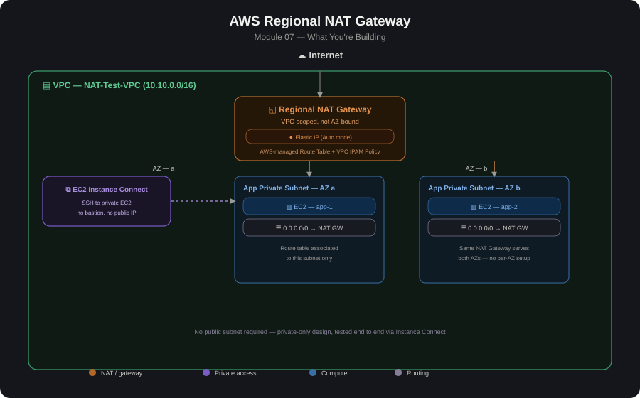

# AWS Regional NAT Gateway

# Overview

Regional NAT Gateway is a newer availability mode for AWS NAT Gateway (announced late 2025) that removes the traditional "one NAT Gateway per AZ" design entirely. Instead of provisioning a zonal NAT Gateway in a public subnet in every Availability Zone, you create a single NAT Gateway scoped to the whole VPC/region.
AWS automatically expands it to cover new AZs as workloads appear there, and contracts it when they're removed — no public subnets, no per-AZ route tables, and no manual scaling required.

This sits alongside the traditional Zonal NAT Gateway (covered in the highly-available-nat-gateway module) as a second, simpler option for the same underlying problem: giving private subnets outbound internet access.

1. Regional NAT gateway works at VPC level and spans across multiple Availability Zones.
2. Automatically expands into newer AZs as you deploy your workloads
3. Optionally can choose manual mode to configure AZs for the Reginal NAT gateway
4. Maintains Zonal affinity (Saves inter-AZ Data transfer charge)
5. No need to have Public subnets for the regional NAT gateway
6. Comes with its own Route Table

# Regional vs. Zonal NAT Gateway

Zonal NAT Gateway (traditional) | Regional NAT Gateway (new)

1. Scope: One NAT Gateway per AZ, tied to a specific public subnet | One NAT Gateway for the whole VPC, not tied to any subnet.
2. Public subnet required?: Yes, one per AZ | No — public subnets aren't needed at all.
3. HA across AZs: You design it yourself (one NAT GW + route table per AZ) | Built-in — AWS auto-expands/contracts across AZs as ENIs appear/disappear.
4. Route table: You manage a separate private route table per AZ | Single route entry works across all AZs; AWS creates and manages the NAT's own route table.
5. Cross-AZ NAT data charges: Possible if subnets are misrouted to a NAT Gateway in another AZ | Eliminated — traffic is handled without crossing AZs for NAT processing.
6. New AZ onboarding: Manually create a new NAT Gateway + EIP + route table + associations | Automatic — can take up to \~60 minutes (typically 15–20) to expand once a resource appears in a new AZ
7. Centralized egress via Transit Gateway: Fully supported (standard pattern) | Not currently supported — the Regional NAT Gateway's route table is AWS-managed and can't be customized to redirect return traffic through a TGW
8. IP address control: Per-AZ EIP assignment (manual) | Automatic mode (AWS manages IPs/expansion, recommended) or Manual mode (you manage IPs and AZ coverage yourself)

## Architecture Diagram

# Core Components

1. NAT Gateway (Availability mode = Regional): The single, VPC-wide NAT resource — no subnet is specified at creation.
2. Elastic IP(s): Still required for translation; in Automatic mode AWS manages allocation (optionally from an IPAM pool), in Manual mode you assign EIPs per AZ yourself via associate-nat-gateway-address.
3. AWS-managed Route Table ("Edge Association"): Automatically created for the Regional NAT Gateway with a default route to the Internet Gateway and a local route for the VPC CIDR. Limited customization — you can add routes for middlebox return traffic, but not for redirecting to a Transit Gateway.
4. VPC-level route entry: Private subnets need just one route (0.0.0.0/0 → the Regional NAT Gateway ID) — the same entry works for every AZ, unlike zonal NAT where each AZ needs its own route table.
5. VPC IPAM Policy (optional): Lets you centrally define which IP pool (Amazon-provided or BYOIP) the Regional NAT Gateway draws its addresses from, useful at scale for partner IP allowlisting via managed prefix lists.

# Build Steps (typical order) - see [AWS_Regional NAT Gateway.docx](./AWS_Regional%20NAT%20Gateway.docx) for the full walkthrough

1. Confirm VPC/subnet layout — private subnets across the AZs you want covered; no public subnets are required for the NAT Gateway itself (though you may still want one for other public-facing resources like an ALB).
2. Create the NAT Gateway with Availability mode = Regional
Choose the VPC (no subnet selection — Regional NAT isn't tied to one).
Choose Automatic (recommended — AWS manages IPs and AZ expansion) or Manual (you assign EIPs per AZ and control expansion yourself).

(Manual mode only) Associate EIPs per AZ
bash   aws ec2 associate-nat-gateway-address  
--nat-gateway-id nat-12345678  
--availability-zone us-east-1b  
--allocation-ids eipalloc-12345678

3. Add the route in each private subnet's route table (or a shared one, since the NAT Gateway isn't AZ-specific):0.0.0.0/0 → the Regional NAT Gateway ID (same target works for every AZ).
4. (Optional) Review the AWS-managed route table created for the NAT Gateway — it comes with a default route to the Internet Gateway and can be extended for return routes to middleboxes (e.g., a Gateway Load Balancer / Network Firewall endpoint), but not for TGW redirection.
5. (Optional) Attach an IPAM policy if you need centralized, scoped control over which IP pool the NAT Gateway draws from — useful for organizations needing predictable, allowlistable IP ranges.
6. Test
Launch an instance in a new AZ that previously had no workloads;confirm outbound internet access starts working within the expected expansion window (\~15–20 min typical, up to 60 min).
Confirm there's no need to touch route tables or create new NAT Gateways as you add AZs.

# Lessons Learned

1. AZ expansion is not instant — after a resource appears in a new AZ,it can take up to \~60 minutes (commonly 15–20) for the Regional NAT Gateway to expand overage there. Until then, traffic from that AZ is processed via an existing AZ's path, which can incur cross-AZ charges during the transition window.
2. Not currently compatible with centralized egress via Transit Gateway — the Regional NAT Gateway's AWS-managed route table can't be customized to send return traffic back through a TGW to spoke VPCs.For a hub VPC centralized-NAT pattern (like Module 04's TGW hub),the traditional zonal NAT Gateway is still the documented approach.
3. Expansion is triggered by ENI presence, not active traffic — a resource just existing in a new AZ triggers expansion, whether or not it's actively sending traffic.
4. No public subnet needed — this can simplify VPC design and reduce the "accidentally public" surface area, but if you still need a public subnet for other resources (e.g., ALB, bastion), that's unrelated and still required for those specific resources.
5. Manual mode shifts more responsibility to you — if you choose Manual, you're responsible for assigning IPs per AZ and don't get the automatic AZ expansion/contraction that makes Regional NAT appealing in the first place; Automatic mode is what most guidance recommends.
6. Reduces, but doesn't necessarily eliminate cost — it removes the need for multiple NAT Gateways and their associated EIPs/hourly charges,and avoids cross-AZ NAT data-processing charges, but data-processing charges for traffic through the NAT itself still apply. Worth doing a side-by-side cost comparison against a 3-AZ zonal design for your specific traffic pattern.
7. Regional availability, with exceptions — available in all commercial AWS Regions except AWS GovCloud (US) and China Regions as of its initial launch; verify current availability in your target region.

# When to Use Regional vs. Zonal

1. Use Regional NAT Gateway for most new VPC designs — simpler routing,automatic HA, no public subnet requirement, avoids cross-AZ NAT charges.
2. Stick with Zonal (per-AZ) NAT Gateways if you need:
Centralized egress through a Transit Gateway hub VPC (current limitation of Regional NAT).
Fine-grained per-AZ routing control (e.g., routing specific AZ traffic through different middleboxes).

# Validation / Testing Checklist

1. NAT Gateway created with Availability mode = Regional.
2. Private subnet route table has a single 0.0.0.0/0 route pointing at the Regional NAT Gateway (verify it applies across all relevant AZs).
3. Outbound internet access works from instances in every AZ tested.
4. Adding a workload to a new AZ results in automatic expansion within the expected window.
5. (If cost-sensitive) Compare NAT-related cost against an equivalent zonal, per-AZ design using Cost Explorer or the NAT Gateway line items.
6. (If applicable) Confirm AWS Compute Optimizer's "unused NAT Gateway" recommendations aren't flagging misconfigured/idle NAT resources.

