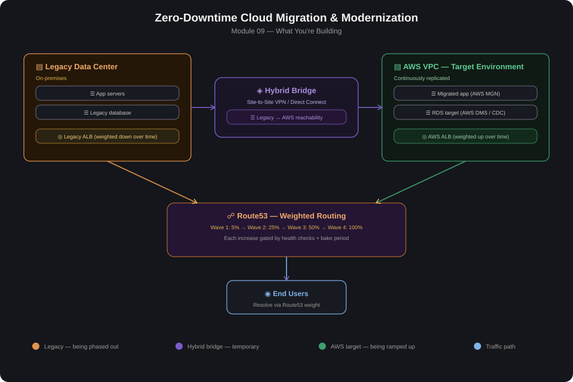

# 09 — Zero-Downtime Cloud Migration & Modernization

## Overview

This module documents the migration pattern used to move a legacy,
on-premises workload to AWS with **zero downtime** — the same underlying
approach used across a 50+ site global SD-WAN and application migration
(Shell) and a 35+ site LAN/WAN modernization (P&G, Michelin). The goal
isn't just "get the workload running on AWS" — it's proving a safe,
reversible, wave-based cutover with a running rollback option at every
stage, rather than a single high-risk cutover weekend.

The pattern has four phases:

1. **Bridge** — establish hybrid connectivity between the legacy data
   center and AWS (built on Modules 05/06 — Site-to-Site VPN and/or Direct
   Connect) so both environments can reach each other during migration.
2. **Replicate** — stand up the AWS-side environment and continuously
   replicate data/state from the legacy environment, so the AWS side is
   never more than seconds behind.
3. **Shift** — gradually move live traffic from legacy to AWS using
   weighted DNS routing, moving the percentage up only as each wave is
   validated.
4. **Decommission** — once 100% of traffic is confirmed stable on AWS for
   an agreed bake period, decommission the legacy resources — not before.

## Core Components

| Component | Role |
|---|---|
| **Hybrid connectivity (Site-to-Site VPN / Direct Connect)** | Bridges legacy data center and AWS during the migration window — built per Modules 05/06 |
| **AWS Application Migration Service (MGN)** | Continuous, near-real-time block-level replication of on-prem servers into AWS-ready instances, without a maintenance-window cutover |
| **AWS Database Migration Service (DMS)** | Continuous database replication (CDC — change data capture) from the legacy database to an RDS target, kept in sync until final cutover |
| **Route53 weighted routing** | Gradually shifts live user traffic from the legacy endpoint to the new AWS endpoint in controlled percentages (e.g., 5% → 25% → 50% → 100%) |
| **ALB target groups (legacy + AWS)** | Allows both environments to serve traffic simultaneously during the shift phase |
| **CloudWatch + Application-level health checks** | Continuously validates the AWS side is healthy at each traffic-weight increase before proceeding to the next wave |
| **Rollback plan (runbook)** | A documented, tested path back to 100% legacy traffic at any point before decommission, not an assumption |

## Build Steps

1. **Assess and wave-plan** the workloads to migrate — group by
   dependency (e.g., app tier and its database migrate together), and
   sequence lower-risk workloads in earlier waves to validate the process
   before higher-risk ones follow.
2. **Establish the hybrid bridge** — build Site-to-Site VPN and/or Direct
   Connect connectivity between the legacy data center and the target AWS
   VPC (per Modules 05/06), and validate bidirectional reachability.
3. **Replicate compute** with AWS MGN — install the replication agent on
   source servers, let initial sync complete, and confirm continuous
   replication lag stays within an acceptable window.
4. **Replicate data** with AWS DMS — configure a CDC-based replication
   task from the source database to an RDS target, and monitor replication
   lag continuously.
5. **Stand up the AWS-side serving path** — ALB, target groups, and
   Auto Scaling Group (per Module 03) pointing at the migrated/replicated
   resources, fully built and tested before any real traffic is shifted.
6. **Cut over in waves using Route53 weighted routing** — start at a small
   percentage (e.g., 5%), monitor application health and error rates,
   and increase the weight only after each wave is confirmed stable for an
   agreed bake period.
7. **Reach 100% weight on AWS** and continue monitoring for a full
   decommission bake period (e.g., 1–2 weeks) before touching legacy
   resources.
8. **Decommission legacy resources** only after the bake period passes
   with no rollback triggered, and confirm the hybrid bridge is no longer
   required (or is intentionally kept for other workloads still migrating).

## Lessons Learned

- **The rollback plan has to be tested before it's needed, not written and
  left untested.** A rollback runbook that's never been exercised is a
  hope, not a plan — reversing a Route53 weight back to legacy needs to be
  a rehearsed, fast action, not a first attempt during an incident.
- **Replication lag is the real gating metric for cutover readiness, not
  a fixed calendar date.** Moving traffic weight up on a schedule instead
  of on measured replication lag risks cutting over onto data that's
  further behind than assumed.
- **Wave sequencing by dependency, not by convenience, avoids partial
  cutover states.** Migrating an app tier to AWS while its database stays
  on-prem (or vice versa) reintroduces the exact cross-environment latency
  and failure-mode complexity the migration is meant to eliminate — unless
  that's an explicit, temporary, well-understood intermediate state.
- **DNS TTLs need to be lowered well before cutover begins**, not on the
  day of — a long-cached TTL means a rollback doesn't actually take effect
  quickly for a meaningful fraction of users, undermining the entire
  point of gradual, reversible weighting.
- **"Zero downtime" means zero *user-visible* downtime, not zero
  operational complexity** — this pattern trades a single risky cutover
  event for a longer period of dual-running complexity (two environments,
  replication monitoring, dual on-call awareness), which needs to be
  resourced and planned for, not treated as free.

## Validation Checklist

- [ ] Hybrid connectivity (VPN/Direct Connect) between legacy and AWS is
      confirmed stable and within acceptable latency
- [ ] AWS MGN replication lag is within the agreed threshold for all
      in-scope servers before the first traffic shift
- [ ] AWS DMS replication lag is within the agreed threshold and CDC is
      confirmed actively applying changes, not just an initial full load
- [ ] Rollback runbook has been tested end-to-end at least once in a
      non-production wave before being relied on in production
- [ ] Route53 TTLs were lowered ahead of cutover and confirmed propagated
- [ ] Each traffic-weight increase is preceded by an explicit go/no-go
      check against agreed health metrics (error rate, latency, business
      KPIs) — not a blind schedule-based increase
- [ ] 100% AWS traffic weight is sustained through the full agreed bake
      period with no rollback triggered before legacy decommission begins
- [ ] Legacy resources are decommissioned only after bake period sign-off,
      with a documented decision, not left running indefinitely "just in
      case"
